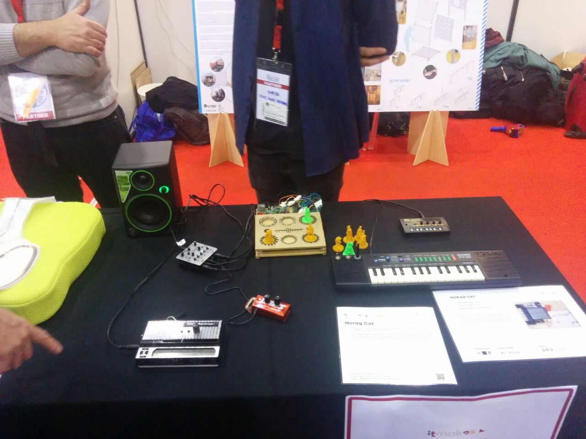
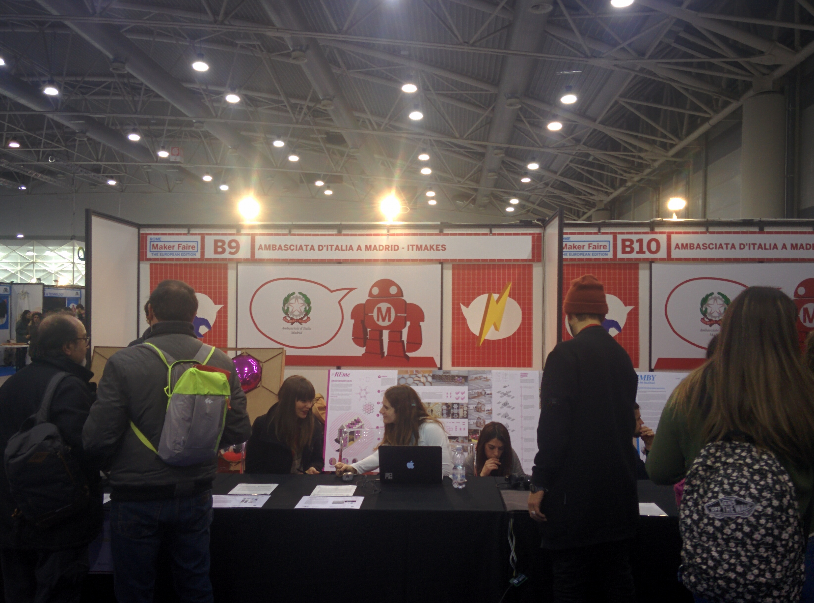

**Norag Cat** es un proyecto de **Hardware/Software Libre** para la creación musical, enfocado concretamente a **instrumentos DIY modulares** y de bajo coste. Este proyecto empezó a mediados de 2017 con la ayuda de [Ambasciata d'Italia Madrid](http://www.ambmadrid.esteri.it/ambasciata_madrid/es/) y [The Fab Linkage](https://thefablinkage.net/). Surge con el principal objetivo de aprender electrónica y de experimentar con la música Noise.  

La primera pincelada del proyecto se expuso en la [Maker Faire Roma](http://www.makerfairerome.eu/it/espositori/?ids=6765) con un Mixer DIY con tecnología NFC, un teclado CASIO PT-22 modificado, un Stylophone modificado y una Atari Punk Console.

Norag Cat será una carpeta donde se irá rellenando con herramientas libres, documentación, hazañas, etc. **No tendrá un producto final**, sino que será un ecosistema de trabajos con la linea de creación de música electrónica.

Las **principales referencias** de este proyecto son [Bast-Instrumets](http://www.bastl-instruments.com/), una comunidad de creación de herramientas de música electrónica, y el libro de [Sopa de ortiga de Olaf Ladousse](http://www.olafladousse.com/), donde se explica una técnica llamada Circuit Bending muy utilizada en este proyecto.

**La sede** de Norag Cat es [MakeSpace Madrid](http://makespacemadrid.org/) y cuenta con la **coolaboración** de [The Pymiento Proyect](http://thepymientoproject.com/) y de [HackLab Almería](http://hacklabalmeria.net/).

amil101@debian:~$ EXIT
