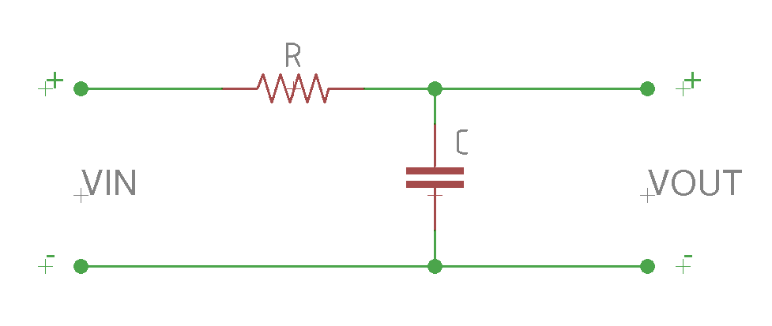
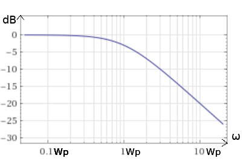
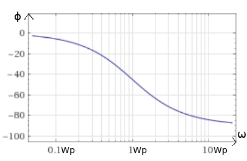

En este post intentaré explicar el funcionamiento el filtro paso bajo desde una forma matemática. Para entenderlo hará falta entender un mínimo el análisis de circuitos en el régimen sinusoidal permanente, los números complejos y los fasores.

### ¿Qué es un filtro paso bajo?
Se trata de un circuito muy común que elimina las altas frecuencias y deja pasar las bajas frecuencias. Hay dos tipos de filtros, los pasivos y los activos. Los pasivos, están constituidos por resistencias, condensadores y bobinas, en cambio, los activos utilizan además amplificadores operacionales. En este caso vamos a estudiar el filtro paso bajo pasivo, que se puede hacer por medio de una resistencia y un condensador:

La función de transferencia define la relación entre la señal de salida y la de entrada:

$$
H(j\omega) = \frac{V_{OUT}}{V_{IN}}
\qquad
V_{OUT} = H(j\omega)V_{IN}
$$

Las diferentes relaciones que tiene la señal de entrada, la función de transferencia y la señal de salida es la siguiente:

Propiedad | \\(V_{IN}\\) | \\(H(j\omega)\\) | \\(V_{OUT}\\) |
--- | --- | --- | --- |
Amplitud | A | \\(\mid H(j\omega)\mid\\) | \\(A\mid H(j\omega)\mid\\)
Fase | \\(\phi\\) | \\(\beta(\omega)\\) |\\(\phi + \beta\\)
Freq | \\(\omega\\) | | \\(\omega\\) |
{: .tablelines}

Es decir, que la función de entrada y salido será:

$$
V_{IN} = V_{\phi} = V_{0} \cos(\omega t + \phi)
\\
V_{OUT} = V_{0} {\mid H\mid }_{\phi + \beta} = V_{0}\mid H(j\omega)\mid\cos(\omega t + \phi + \beta)
$$

En nuestro circuto, cogiendo la malla de la izquierda y por Kirchhoff llegamos a la siguiente igualdad:

$$
V_{IN} = I(R + \frac{1}{j\omega C}) \Rightarrow I = \frac{V_{IN}}{R + \frac{1}{j\omega C}};
\\
V_{OUT} = V_{C} = I \frac{1}{j\omega C} = V_{IN}\frac{\frac{1}{j\omega C}}{R + \frac{1}{j\omega C}}
\\
= V_{IN}\frac{\frac{1}{j\omega C}}{\frac{j\omega RC + 1}{j\omega C}} = V_{IN}\frac{1}{j\omega RC + 1}
$$

De esta expresión sacamos la función de transferencia:

$$
H(j\omega) = \frac{V_{OUT}}{V_{IN}} = \frac{1}{1 + j\omega RC} = {\mid H\mid}_{\beta}
$$

La función de transferencia expresada en forma binómica:

$$
H(j\omega) = \frac{1}{1 + j\omega RC} = \frac{1}{1 + j\omega RC} \cdot \frac{1 - j\omega RC}{1 - j\omega RC}
\\
=  \frac{1 - j\omega RC}{1^2 + {\omega}^2 R^2C^2} = \frac{1}{1 + {\omega}^2 R^2C^2} - j\frac{\omega RC}{1 + {\omega}^2 R^2C^2}
$$

Expresado en forma polar:

$$
\mid H(j\omega)\mid = \sqrt{\frac{1}{1+{\omega}^2R^2C^2}}
\\
\beta = \arctan \Bigg (\frac{-\frac{\omega RC}{1 + {\omega}^2 R^2C^2}}{\frac{1}{1 + {\omega}^2 R^2C^2}}\bigg) = \arctan (-\omega RC) = -\arctan (\omega RC);
$$

$$
H(j\omega) = {\sqrt{\frac{1}{1+{\omega}^2R^2C^2}}}_{-\arctan (\omega RC)}
$$

Con lo que llegamos a:

$$
V_{OUT} = V_{0} {\mid H\mid }_{\phi + \beta} = V_{0}\mid H(j\omega)\mid\cos(\omega t + \phi)
\\
V_{OUT} = V_{0} \sqrt{\frac{1}{1+{\omega}^2R^2C^2}} \cos(\omega t + \phi -\arctan (\omega RC))  
$$

Como vemos la amplitud de la señal final se ve afectada con el módulo de la función de transferencia. La funcion de tranferencia, \\(H(j\omega)\\), depende de la frecuencia angular, y esta modifica tanto la amplitud de la señal como la fase de la señal de salida. Por tanto, la función de transferencia, \\({\mid H\mid}_{\beta}\\), representa la atenuación de la señal, \\(\mid H(j\omega)\mid\\), y el desfase de la salida, \\(\beta\\).

Para representar la atenuación de la señal, la función de transferencia, se utilizan los diagramas de Bode.

### Diagramas de Bode
La funcón de transferencia se puede escribir como cociente de dos polinomios de coeficientes reales:

$$
H(s = j\omega) = K \cdot \frac{(s - {z}_{1})(s - {z}_{2})(s - {z}_{3}) \cdot \cdot \cdot (s - {z}_{n})}{(s - {p}_{1})(s - {p}_{2})(s - {p}_{3}) \cdot \cdot \cdot (s - {p}_{n})}
$$

Donde:
* \\({z}_{1}, {z}_2 ,..., {z}_n\\) son ceros de la función de transferencia.
* \\({p}_{1}, {p}_2 ,..., {p}_n\\) son polos de la función de transferencia.

De la misma forma se puede expresar como:

$$
\mid H(\omega)\mid  = \frac{\prod_{i=0}^{n} \mid N_{i}(w)\mid}{\prod_{k=0}^{m} \mid D_{k}(w)\mid}
$$

Aplicando logatimos se puede expresar el módulo como suma y diferencia de factores:

$$
{\mid H(\omega)\mid}_{dB} = 20\log{\mid H(\omega)\mid} = \sum_{i=0}^{n} 20\log{\mid N_{i}(w)\mid} - \sum_{k=0}^{m} 20\log{\mid D_{k}(w)\mid}
$$

La fase se escribe como suma y diferencia de factores:

$$
\phi (w) = \sum_{i=0}^{n} {\phi}_i(\omega) - \sum_{k=0}^{m} {\phi}_k(\omega)
$$

En nuestros circuto el diagrama de Bode lo representariamos así:

##### Módulo
Primero sacamos los polos y los ceros:

$$
H(s = j\omega) = \frac{1}{1+sRC} = \frac{1}{RC(\frac{1}{RC} +s)} = \frac{\frac{1}{RC}}{\frac{1}{RC} +s} \Rightarrow W_{p} = \frac{1}{RC}  
$$

En este caso solo hay un único polo. Ahora sacamos la función de transferencia expresada en logaritmos:

$$
{\mid H(s = j\omega)\mid}_{dB} = 20\log{\mid H(w)\mid}
$$

$$
{\mid H(s = j\omega)\mid}_{dB} = 20\log{\bigg(\frac{\mid 1\mid}{\mid 1 + \frac{s}{W_{p}}\mid}\bigg)} = - 20 \log{\bigg ( \sqrt{1 + \frac{\omega^2}{W_{p}^2}}\bigg)}
$$

Con lo que nos encontramos en lo siguientes tres casos.

$$
\left .
     \begin{matrix}
        Si \; \omega \ll \omega_{p} \Rightarrow {\mid H(s = j\omega)\mid}_{dB} \approx 0\\
        Si \; \omega = \omega_{p} \Rightarrow {\mid H(s = j\omega)\mid}_{dB} = -2\log{\sqrt{2}} \approx 3dB\\
        Si \; \omega \gg \omega_{p} \Rightarrow {\mid H(s = j\omega)\mid}_{dB} \approx -20log{ \Big (\frac{\omega}{\omega_{p}} \Big )}
     \end{matrix}
  \right \}
$$

Se representaría tal que así:

##### Fase
Primero sacamos el \\(\phi\\):

$$
\phi (\omega) = Arg(1) - Arg(1 + \frac{s}{\omega_{p}})
\\
Arg(1) = \arctan(0) = 0
\\
Arg(1 + \frac{s}{\omega_{p}}) = \arctan(\frac{\frac{\omega}{\omega_{p}}}{1}) =  \arctan({\frac{\omega}{\omega_{p}}})
\\
\phi (\omega) = -\arctan({\frac{\omega}{\omega_{p}}})

{\omega}_{p}
$$

Los siguientes 3 casos serían los posibles:

$$
\left .
     \begin{matrix}
        Si \; \omega \ll {\omega}_{p} \Rightarrow \phi \approx 0\\
        Si \; \omega = {\omega}_{p} \Rightarrow \phi= -\frac{\pi}{4}\\
        Si \; \omega \gg {\omega}_{p} \Rightarrow \phi= -\frac{\pi}{2}
     \end{matrix}
  \right \}
$$

Y la representación de la fase sería:

Como vemos, las atenuación se produce en las altas frecuencias, haciendo así un filtro paso bajo.

amil101@debian:~$ EXIT

### Enlaces externos
* [http://dfs.uib.es/GTE/education/industrial/teo_circuits/RPS.pdf](http://dfs.uib.es/GTE/education/industrial/teo_circuits/RPS.pdf)
* [https://sites.google.com/a/goumh.umh.es/circuitos-electronicos-analogicos/transparencias/tema-2#Subir](https://sites.google.com/a/goumh.umh.es/circuitos-electronicos-analogicos/transparencias/tema-2#Subir)
* [http://repositorio.innovacionumh.es/Proyectos/P_19/Tema_5/UMH_02.htm](http://repositorio.innovacionumh.es/Proyectos/P_19/Tema_5/UMH_02.htm)
* [http://csrgxtu.github.io/2015/03/20/Writing-Mathematic-Fomulars-in-Markdown/](http://csrgxtu.github.io/2015/03/20/Writing-Mathematic-Fomulars-in-Markdown/)
