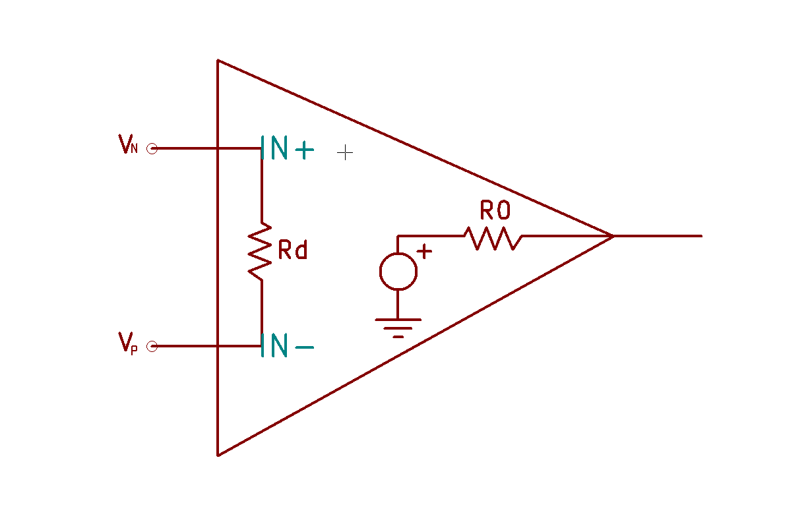
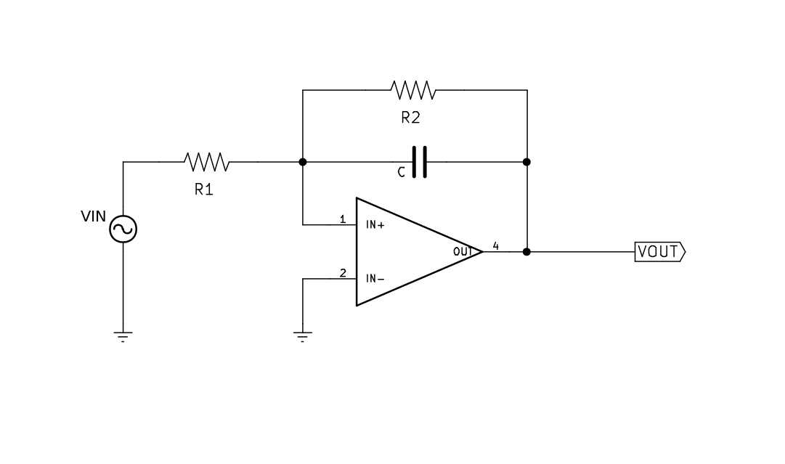
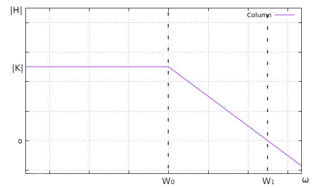

En el [artículo anterior](../Filtro-paso-bajo/) expliqué cómo funcionaba el filtro paso bajo pasivo, desde sacar su función de transferencia hasta los diagramas de Bode. En este artículo, en cambio, explicaremos el funcionamiento del filtro paso bajo activo con ganancia, que se hace mediante Amplificadores operacionales. Ademaś aprovecharemos para explicar en que consisten dichos dispositivos. Para entenderlo hará falta saber un mínimo el análisis de circuitos en el régimen sinusoidal permanente, los números complejos y los fasores.

### ¿Qué es un filtro paso bajo activo con ganancia?
Se trata de un circuito muy común que elimina las altas frecuencias y deja pasar las bajas frecuencias. El "activo" se refiere a que hace uso de amplificares operacionales, sustituyendo a las clásicas bobinas. Y la "ganancia" se refiere que aumenta el volumen de las bajas frecuencias.

#### Amplificador operacional
El amplificador operacional es un amplificador de voltaje con ganancia de voltaje extremadamente alta. Un amplificador de voltaje bien diseñado debe establecer una corriente insignificante (de cero, en forma ideal) desde la fuente de entrada, y tiene que tener una resistencia despreciable (igual a cero, idealmente) a la carga de salida:

El amplificador operacional posee las siguientes características:

* \\(R_d = \infty\\)
* \\(R_0 = 0\\)
* \\(i_p = i_n = 0\\)
* \\(V_0 = a(V_P - V_N)\\)
* \\(a = \infty \\). Es decir que de la expresión anterior, podemos decir que \\(V_P = V_N\\)

donde \\(i_p\\) e \\(i_n\\) son las corrientes establecidas por las entradas no inversora e inversora. Se trata de un dispositivo muy usado porque se puede utilizar, como su nombre indica, para realizar operaciones dependiendo de como se configuren sus entradas. En nuestro caso lo utilizaremos para crear un filtro paso bajo con ganancia.

### El circuito

Habiendo explicado lo anterior, vamos con el circuito. El esquemático sería el siguiente:

Para sacar la función de transferencia primero tenemos que sacar la relación entre la corriente de entrada y la salida. Si nos colocamos en el nodo del voltaje negativo de entrada al amplificador y hacemos Kirchhoff por corrientes de nodo:

$$
V_{P} = V_{N} = 0
$$

$$
\frac{V_{IN} - V_{N}}{R_{1}} = \frac{V_{N} - V_{OUT}}{R_{2}} + \frac{V_{N} - V_{OUT}}{Z_C}

\\

\Rightarrow \frac{V_{IN}}{R_{1}} = -\frac{ V_{OUT}}{R_{2}} - \frac{ V_{OUT}}{Z_C}

\\

\Rightarrow \frac{V_{IN}}{R_{1}} = -V_{OUT}\bigg(\frac{1}{R_{2}} + \frac{1}{Z_C}\bigg) = -V_{OUT}\bigg( \frac{Z_C +R_2}{R_2 Z_C}\bigg)

\\
\Rightarrow V_{IN} = V_{OUT}\bigg( \frac{-R_1(Z_C +R_2)}{R_2 Z_C}\bigg)
$$

De esta expresión sacamos la función de transferencia:

$$
H(j\omega) = \frac{V_{OUT}}{V_{IN}} = - \frac{R_2}{R_1} \cdot \frac{Z_C}{Z_C + R_2}
\\
= - \frac{R_2}{R_1} \cdot \frac{\frac{1}{j\omega C}}{\frac{1}{j\omega C} + R_2} = - \frac{R_2}{R_1} \cdot \frac{1}{j\omega C \big(\frac{1}{j\omega C} + R_2\big)}

\\
= - \frac{R_2}{R_1} \cdot \frac{1}{1 + R_2Cj\omega}

$$

Simplificando llegamos a:

$$

H(s = j\omega) = - \frac{R_2}{R_1} \cdot \frac{1}{1 + R_2Cs} = - \frac{R_2}{R_1} \cdot \frac{1}{R_2C(\frac{1}{R_2C} + s)}

\\

=  - \frac{R_2}{R_1} \cdot \frac{\frac{1}{R_2C}}{\frac{1}{R_2C} + s}

$$

De aquí podemos sacar, con la función de transferencia expresada en polinomios, que \\(K = -\frac{R_2}{R_1}\\) y que hay un polo en \\(Z_1 = -\frac{1}{R_2C}\\)

Para simplificar, diremos que \\(K = -\frac{R_2}{R_1}\\) y \\(\omega_{0} = \frac{1}{R_2C}\\)

$$

H(s = j \omega) = K \cdot \frac{\omega_{0}}{\omega_{0} + s} = K \cdot \frac{1}{1 + \frac{s}{\omega_{0}}}

$$

Como en el artículo anterior, haremos los diagramas de Bode, aunque esta vez solo del módulo porque nos interesa ver cuanto se atenua (o amplifica) la señal de salida.

$$
{\mid H(\omega) \mid}_{dB} =  20\log{\mid H(\omega)\mid} = 20\log{\frac{\mid K\mid}{\mid 1 + \frac{s}{\omega_0}\mid}}

\\

= 20\log{\mid K\mid} - 20\log{\frac{\mid K\mid}{\mid 1 + \frac{s}{\omega_0}\mid}} = 20\log{\mid K\mid} - 20\log{\sqrt{1 + \frac{\omega^2}{\omega_0^2}}}
$$

Con lo que nos encontramos en los siguientes tres casos:

$$
\left .
     \begin{matrix}
        Si \; \omega \ll \omega_{0} \Rightarrow {\mid H(s = j\omega)\mid}_{dB} = 20 \log{\mid K\mid}

        \\

        Si \; \omega = \omega_{0} \Rightarrow {\mid H(s = j\omega)\mid}_{dB} = 20 \log{\mid K\mid} - 20 \log{\sqrt{2}}

        \\

        Si \; \omega \gg \omega_{0} \Rightarrow {\mid H(s = j\omega)\mid}_{dB} = 20 \log{\mid K\mid} - 20 \log{(\frac{\omega}{\omega_p})}
     \end{matrix}
  \right \}
$$

Se representaría tal que así:

Es decir, se amplifica la señal K veces en las frecuencias bajas, y se atenuan las altas frecuencias. Haciendo así un filtro paso bajo con ganancia.

amil101@debian:~$ EXIT

### Enlaces externos
* [http://files.tecnica8-electromecanica.com/200001486-8213d830e8/Amplificadores%20Operacionales-Sergio%20Franco.pdf](http://files.tecnica8-electromecanica.com/200001486-8213d830e8/Amplificadores%20Operacionales-Sergio%20Franco.pdf)
