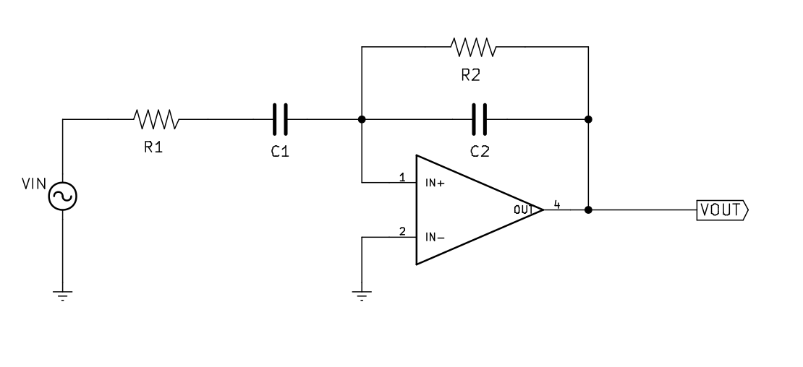
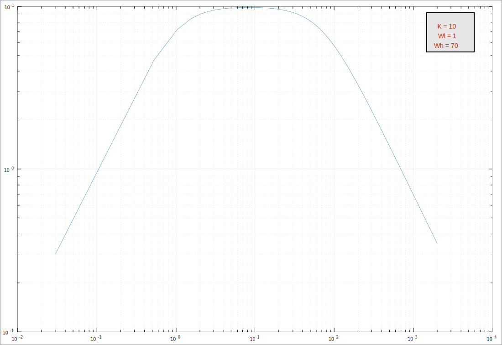

Para hacer el ecualizador, qué tenemos como objetivo, usaremos tres filtros paso banda con ganancia: uno para los altos, otros para los bajos, y otro para lo medios. En este artículo, siguiendo con los anteriores, explicaré cómo funciona el filtro paso banda activo con operacionales. Para entenderlo hará falta saber un mínimo el análisis de circuitos en el régimen sinusoidal permanente, los números complejos y los fasores. También se recomienda leer los anteriores posts del blog porque muchos conceptos no se volverán a explicar otra vez.

### ¿Qué es un filtro paso banda activo con ganacia?

Se trata de un circuito muy común que deja pasar unas determinadas frecuencias (dependerá de las conexiones del operacional). El filtro tendrá ganacia, con lo que se podrá aumentar el volumen de ciertas frecuencias, cosa que nos interesa para el futuro ecualizador.

### El circuito

El esquemático del circuito es el siguiente:



Este circuito es muy parecido al filtro paso bajo con ganancia y al filtro paso alto con ganancia, pues se trata del conjunto de los dos para conseguir el filtro paso medio. Lo analizaremos igual que analizamos el filtro paso bajo en el artículo anterior.

Para sacar la función de transferencia primero tenemos que sacar la relación entre la corriente de entrada y la salida. Si nos colocamos en el nodo del voltaje negativo de entrada al amplificador y hacemos Kirchhoff por corrientes de nodo:

$$
V_{P} = V_{N} = 0
$$

$$

\frac{V_{IN} - V_{N}}{R_{1} + Z_{C1}} = \frac{V_{N} - V_{OUT}}{R_{2}} + \frac{V_{N} - V_{OUT}}{Z_{C2}}

\\

\Rightarrow \frac{V_{IN}}{R_{1} + Z_{C1}} = - \frac{V_{OUT}}{R_2} - \frac{V_{OUT}}{Z_{C2}} = -V_{OUT} \cdot \bigg(\frac{1}{R_2} - \frac{1}{Z_{C2}}\bigg) = - V_{OUT} \cdot \bigg(\frac{R_2 + Z_{C2}}{R_2 \cdot Z_{C2}}\bigg)

\\

\Rightarrow V_{IN} = V_{OUT} \cdot \bigg(-\frac{(R_2 + Z_{C2})(R_1 + Z_{C1})}{R_2 \cdot Z_{C2}} \bigg)
$$

De esta expresión sacamos la función de transferencia:

$$

H(j\omega) = \frac{V_{OUT}}{V_{IN}} = - \frac{R_2 \cdot Ẓ_{C2}}{(R_2 + Z_{C2})(R_1 + Z_{C1})}

\\

= - \frac{R_2 \cdot \frac{1}{j\omega C_2}  }{(R_2 + \frac{1}{j\omega C_2})(R_1 + \frac{1}{j\omega C_1})} = - \frac{R_2 \cdot \frac{1}{j\omega C_2}}{(\frac{R_2 j \omega C_2 + 1}{j \omega C_2})(\frac{R_1 j \omega C_1 + 1}{j \omega C_1})}

\\

= - \frac{R_2j\omega C_1}{(R_2 j \omega C_2 + 1)(R_1 j \omega C_1 + 1)} = - \frac{R_2}{R_1} \cdot \frac{R_1 j \omega C_1}{R_1 j \omega C_1 + 1} \cdot \frac{1}{R_2 j \omega C_2 + 1}

$$

Simplificando llegamos a:

$$

H(s = j\omega ) = - \frac{R_2}{R_1} \cdot \frac{R_1 C_1 s}{R_1 C_1 s + 1} \cdot \frac{1}{R_2 C_2 s + 1}

\\

= - \frac{R_2}{R_1} \cdot \frac{R_1 C_1 s}{R_1 C_1 (s + \frac{1}{R_1 C_1})} \cdot \frac{1}{R_2 C_2 (s + \frac{1}{R_2 C_2})}

\\

= - \frac{R_2 \cdot (R_1 C_1)}{R_1 \cdot (R_1 C_1) \cdot (R_2 C_2)} \cdot \frac{s}{(s + \frac{1}{R_1 C_1}) \cdot (s + \frac{1}{R_2 C_2})}

$$

De aquí podemos sacar, con la función de transferencia expresada en producto de polinomios, que hay un cero en el origen y dos polos en \\(- \frac{1}{R_1 C_1}\\) y en \\(- \frac{1}{R_2 C_2}\\)

Para simplificar diremos que \\(K = -\frac{R_2}{R_1}\\), que \\(\omega_L = \frac{1}{R_1 C_1}\\) y que \\(\omega_H = \frac{1}{R_2 C_2}\\) con lo que la función de transferencia se nos quedaría tal que así:

$$

H (s = j \omega) = K \cdot \frac{j\omega/\omega_L}{(1 + j\omega/\omega_L)(1 + j\omega/\omega_H)}

$$

El diagrama de Bode para representar la función de tranferencia no es tan fácil como en los artículos anteriores, sino que tenemos más variables y la cosa se complica, por lo que usaremos Octave/Matlab para representarla. No hay que olvidar que los diagramas de Bode se representan en escala doble logarítmica, para que esté expresada en decibelios de atenuación.

Primero tendremos que sacar el módulo de la función de transferencia, que está expresada con números complejos:

$$

\mid H(j \omega) \mid = \frac{\mid K \cdot \cfrac{j \omega}{\omega_L} \mid}{\mid (1 + j\omega / \omega_L)(1 + j\omega / \omega_H)\mid} = K \frac{\omega}{\omega_L} \cdot \frac{1}{\mid 1 + \frac{j\omega}{\omega_H} + \frac{j\omega}{\omega_L} - \frac{\omega^2}{\omega_L \omega_H}\mid}

\\

= K \frac{\omega}{\omega_L} \cdot \Bigg(\Big(1 - \frac{\omega^2}{\omega_L \omega_H}\Big)^2 + \Big(\frac{\omega(\omega_L + \omega_H)}{\omega_L \omega_H}\Big)^2\Bigg)^{-1/2}

$$

Creamos la siguiente función de Octave/Matlab llamada [`bandpassactive.m`](../attachments/bandpassactive.m) en la ruta de trabajo:

```python

function y = bandpassactive(w, k, wl, wh)
	#{
	Calcular la atenuación de un filtro paso banda con ganancia. Si no tiene ganancia, k = 0

	Parameters
	----------
	k : int
		Ganancia, ej: 10
	wl : int
		Frecuencia de corte inferior ej: 1
	wh : int
		Frecuancia de corte superior ej: 70

	Returns
	-------
	int
		Devuelve el valor de atenuación del filtro paso banda

	#}


	# Funcion de transferencia
	y = (k * (w./wl)) ./ (sqrt((1 - ((w.^2) ./ (wl * wh))).^2 + ((w.^2) .* ((1/wh) + (1/wl)).^2)));
endfunction

```

Y para representarla, creamos una variable que contenga los valores que tomará la función, y la representamos en escala doble logarítmica:

```python


x = 0.03:0.5:2000;
k = 10;
wl = 1;
wh = 70;
annotation('textbox', [0.85 0.85 0.4 0.4],
	'FitBoxToText','on',
    'String', {['K = ' num2str(k)], ['Wl = ' num2str(wl)], ['Wh = ' num2str(wh)]},...
    'FontSize',14,...
    'FontName','Arial',...
	'HorizontalAlignment', 'center',...
    'LineWidth',2,...
    'BackgroundColor',[0.9  0.9 0.9],...
    'Color',[0.84 0.16 0]);
loglog(x, bandpassactive(x, k, wl, wh))
grid on

```

Y el resultado es el siguiente:



Modificando los valores de k, wl y wh, de la función en octave, modificamos las características de nuestro filtro paso banda.

amil101@debian:~$ EXIT


### Enlaces externos
* [http://files.tecnica8-electromecanica.com/200001486-8213d830e8/Amplificadores%20Operacionales-Sergio%20Franco.pdf](http://files.tecnica8-electromecanica.com/200001486-8213d830e8/Amplificadores%20Operacionales-Sergio%20Franco.pdf)
* [https://stackoverflow.com/questions/14262354/textbox-in-matlab-plot](https://stackoverflow.com/questions/14262354/textbox-in-matlab-plot)
* [https://www.gnu.org/software/octave/doc/v4.2.0/Plot-Annotations.html](https://www.gnu.org/software/octave/doc/v4.2.0/Plot-Annotations.html)
