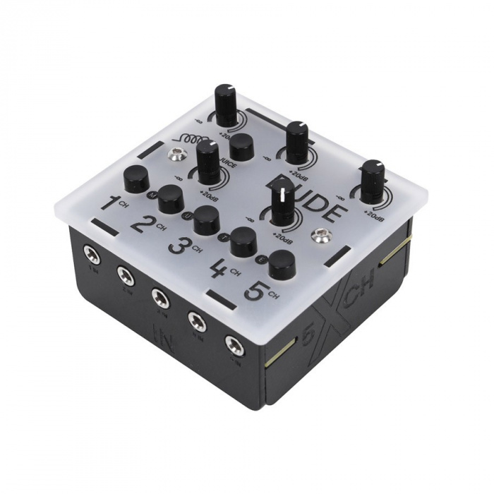

El primer circuito que quiero hacer es un ecualizador modular pequeño que sea transportable. En este artículo trataré de explicar que estoy buscando y cómo lo voy a hacer, en resumidas cuentas las cosas que debería de tener un ecualizador.

Tener un ecualizador pequeño que pueda amplificar es muy útil para la creación de música, pues se puede hacer muchas cosas con él: Corregir el sonido cuando algo suena muy fuerte o muy flojo, hacer algunos efectos como el Cutoff, etc. Lo que estiy buscando es que sea pequeño, útil, modular, portable y simple. El acabado que estoy buscando es que sea de calidad.

Es importante definir los objetivos, porque a raíz de ellos buscaremos las herramientas y los componentes adecuados para este proyecto.

### Tamaño

El tamaño tiene que ser lo suficiente para que entre toda la electrónica, y lo más importante, que entre las baterías. Tengo en mente alimentarlo a través de 4 pilas AA, que darán unos 6 voltios, con lo que las dimensiones rondarán los 7x7 cm.

### Alimentación

Tiene que ser portable, por lo que tendrá que tener la opción de alimentarlo a través de baterías. Tendrá dos formas de alimentación: la principal que será por un cargador de continua de unos 9-12 voltios, y otra por 4 pilas AA conectadas en serie que darán 6 voltios.

### Potencia

La ganacia que tiene que dar en las tres bandas de bajos, medios y altos ha de ser de unos +10/20 dB. Con eso dará suficiente para buscar el efecto que estamos buscando.

### Retroalimentación

A la hora de estar creando música es importante tener conciencia de lo que está sucediendo, por eso mismo el ecualizador tiene que tener una retroalimentación de lo que se está modificando. Debería de tener LED's para el encendido y apagado, y en cada banda que de información de si se está amplificando o atenuando.

### Protección

Para proteger el circuito de los posibles problemas tiene que tener sensores y componentes que lo protegan. Tiene que haber condensadores de acoplo en la entrada de la señal de audio, diodos que protejan un posible cortocircuito y algún termistor que controle la temperatura de las baterias para evitar que exploten. En este aspecto no estoy muy enterado, pero será una cosa importante a tener en cuenta en el proceso de fabricación.

### Aspecto exterior

En la parte exterior quiero conseguir un aspecto parecido al que hacen los de Bastl Instruments, un total referente para hacer este proyecto. Sus acabados son lisos con dibujos sobre los aparatos y con una construcción robusta. Para ello tendré que hacer uso de corte laser o impresión 3D (aunque en esta último no estoy muy interesado).

Un cacharro con una construcción similar sería la de DUDE de Bastl Instruments:

Con esto ya tendríamos definido en gran parte que buscamos y hacia donde vamos.

amil101@debian:~$ EXIT

### Enlaces externos
* [https://soundium.net/bastl-instruments-dude](https://soundium.net/bastl-instruments-dude)
