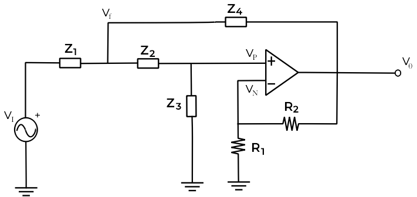
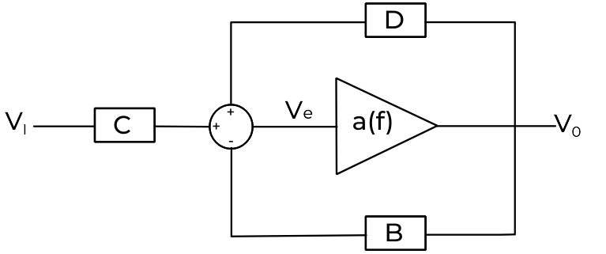

En este artículo vamos a analizar por completo el **filtro Sallen-Key**. Este se trata de un filtro bastante valioso por su simplicidad. Se trata de un filtro de **segundo orden**, con relativa tolerancia en los componentes para conseguir un gran filtro.

El filtro Sallen-Key tiene una configuración genérica, en la que los componentes se toman como impedancias, y dependiendo de que componentes pongamos tendremos un filtro paso bajo, paso medio, paso alto, etc. Hacer el estudio de su función de transferencia con el diagrama genérico tiene especial interés, pues cambiando las impedancias por las impedancias de nuestros componentes tendremos directamente su función de transferencia.

En este artículo vamos a hacer el estudio del diagrama genérico, y en el siguiente veremos la configuración de filtro paso bajo con el Sallen-Key.

El **diagrama del filtro Sallen-Key genérico en terminos de Z** es:

Como se puede ver, hay dos componentes, R3 y R4, que no se toman como impedancias genéricas. Esto se debe a una característica que tiene este filtro que veremos más adelante.

El estudio de este filtro se hace siguiendo los mismo pasos que con los filtros que ya hemos estudiado en este blog. Se coge un nodo, se estudia, luego otro, y otro, así hasta que lleguemos a una expresión de \\(\frac{V_0}{V_I}\\), que sería la función de transferencia. En este caso, las expresiones son mucho más grandes, con lo que tendremos que simplificarlas substituyendo por constantes.

Para empezar, hacemos Kirchhoff por corrientes de nodo en \\(V_f\\):

$$

\frac{V_I - V_f}{Z_1} = \frac{V_f - V_0}{Z_4} + \frac{V_f - V_P}{Z_2}

\\

V_I \cdot \bigg (\frac{1}{Z_1} \bigg) - V_f \cdot \bigg (\frac{1}{Z_1} \bigg) = V_f \cdot \bigg (\frac{1}{Z_4} \bigg) - V_0 \cdot \bigg (\frac{1}{Z_4} \bigg) + V_f \cdot \bigg (\frac{1}{Z_2} \bigg) - V_P \cdot \bigg (\frac{1}{Z_2} \bigg)

\\

\Rightarrow V_f \bigg( \frac{1}{Z_1} + \frac{1}{Z_4} + \frac{1}{Z_2} \bigg ) = V_0 \bigg ( \frac{1}{Z_4} \bigg ) + V_P \bigg ( \frac{1}{Z_2} \bigg ) + V_I \bigg ( \frac{1}{Z_1} \bigg )

$$

Ahora nos vamos al nodo \\(V_P\\) y hacemos lo mismos, para sacar la relación de \\(V_f y V_P\\):

$$

\frac{V_f - V_P}{Z_2} = \frac{V_P - 0}{Z_3}

\\

V_f = V_P + V_P \frac{Z_2}{Z_3} = V_P \bigg ( 1+ \frac{Z_2}{Z_3}\bigg)

$$

Ahora substituimos \\(V_f\\) en la expresión inicial, con lo que llegamos a:

$$

V_P \bigg ( 1+ \frac{Z_2}{Z_3}\bigg)\bigg( \frac{1}{Z_1} + \frac{1}{Z_4} + \frac{1}{Z_2} \bigg ) = V_0 \bigg ( \frac{1}{Z_4} \bigg ) + V_P \bigg ( \frac{1}{Z_2} \bigg ) + V_I \bigg ( \frac{1}{Z_1} \bigg )
$$

La expresión ya se nos está haciendo demasiado grande, así que la trataremos por seaparado. Primero vamos a simplificar \\(V_P\\):

$$

\bigg ( 1+ \frac{Z_2}{Z_3}\bigg)\bigg( \frac{1}{Z_1} + \frac{1}{Z_4} + \frac{1}{Z_2} \bigg ) = \bigg (\frac{Z_3 + Z_2}{Z_3}\bigg)\bigg( \frac{Z_4 Z_2 + Z_1 Z_2 + Z_1 Z_4}{Z_1 Z_2 Z_4} \bigg )

\\

= \bigg ( \frac{Z_2 Z_3 Z_4 + Z_1 Z_2 Z_3 + Z_1 Z_3 Z_4 + Z_4 Z_2^2 + Z_1 Z_2^2 + Z_1 Z_2 Z_4}{Z_1 Z_2 Z_3 Z_4} \bigg)
$$

Juntandolo con lo anterior:

$$

V_P \bigg ( \frac{Z_2 Z_3 Z_4 + Z_1 Z_2 Z_3 + Z_1 Z_3 Z_4 + Z_4 Z_2^2 + Z_1 Z_2^2 + Z_1 Z_2 Z_4}{Z_1 Z_2 Z_3 Z_4} - \frac{1}{Z_2}\bigg)

\\

= V_0 \bigg ( \frac{1}{Z_4} \bigg ) + V_I \bigg ( \frac{1}{Z_1} \bigg )

$$

Ahora vamos a simplificar por separado \\(V_P\\).

$$

\bigg ( \frac{Z_2 Z_3 Z_4 + Z_1 Z_2 Z_3 + Z_1 Z_3 Z_4 + Z_4 Z_2^2 + Z_1 Z_2^2 + Z_1 Z_2 Z_4}{Z_1 Z_2 Z_3 Z_4} - \frac{1}{Z_2}\bigg)

\\

= \bigg ( \frac{Z_2 Z_3 Z_4 + Z_1 Z_2 Z_3 + Z_1 Z_2 Z_4 + Z_4 Z_2 Z_2 + Z_1 Z_2 Z_2}{Z_1 Z_2 Z_3 Z_4}\bigg)

$$

Juntando todo lo anterior llegamos a la expresión siguiente.

$$

V_P \bigg ( \frac{Z_2 Z_3 Z_4 + Z_1 Z_2 Z_3 + Z_1 Z_2 Z_4 + Z_4 Z_2 Z_2 + Z_1 Z_2 Z_2}{Z_1 Z_2 Z_3 Z_4}\bigg) = V_0 \bigg ( \frac{1}{Z_4} \bigg ) + V_I \bigg ( \frac{1}{Z_1} \bigg )

\\

\Rightarrow V_P = V_0 \bigg (\frac{Z_1 Z_2 Z_3}{Z_2 Z_3 Z_4 + Z_1 Z_2 Z_3 + Z_1 Z_2 Z_4 + Z_4 Z_2 Z_2 + Z_1 Z_2 Z_2} \bigg )
\\
+ V_I \bigg ( \frac{Z_2 Z_3 Z_4}{Z_2 Z_3 Z_4 + Z_1 Z_2 Z_3 + Z_1 Z_2 Z_4 + Z_4 Z_2 Z_2 + Z_1 Z_2 Z_2} \bigg)

$$

Ahora tenemos una expresión de \\(V_P\\) mucho más simplificada. Ahora estudiamos las corrientes de nodo \\(V_N\\):

$$

\frac{V_0 - V_N}{R_4} = \frac{V_N - 0}{R_4} \Rightarrow V_0 = V_N + V_N \frac{R_4}{R_3}

\\

V_0 = V_N \bigg (\frac{R_3 + R_4}{R_3 }\bigg) \qquad V_N = V_0 \bigg (\frac{R_3}{R_3 + R_4}\bigg)

$$

Hasta ahora tenemos \\(V_N \quad y \quad V_P\\), que es esencial para encontrar la relación de \\(V_I y V_0\\). Cómo nos queda una expresión muy grande, para simplificar, vamos adecir lo siguiente:

$$

B = \frac{R_3}{R_3 + R_4}

\\

C = \frac{Z_2 Z_3 Z_4}{Z_2 Z_3 Z_4 + Z_1 Z_2 Z_3 + Z_1 Z_2 Z_4 + Z_4 Z_2 Z_2 + Z_1 Z_2 Z_2}

\\

D = \frac{Z_1 Z_2 Z_3}{Z_2 Z_3 Z_4 + Z_1 Z_2 Z_3 + Z_1 Z_2 Z_4 + Z_4 Z_2 Z_2 + Z_1 Z_2 Z_2}

$$

Así nos quedaría una expresión tal que así:

$$

V_P = V_0 \cdot D + V_I \cdot C

$$

En los otros artículos decimos directamente que \\(V_P = V_N\\), pero en este caso lo vamos a abordar de otra forma. Para seguir con el análisis vamos a tener que ir a las características básicas del amplificador operacional. En el primer post [explicando el funcionamiento del amplificador operacional](../Filtro-paso-bajo-con-ganancia/) dijimos lo siguiente:

$$
V_0 = a(V_P - V_N) = a(f)(V_P - V_N) = a(f)V_e
$$

En donde:

$$

a(f) = \infty

$$

De la relación anterior podemos sacar que el esquema se podría simplificar aún más. B, hace referencia solo al camino de las resistencias. C y D tienen un denominador común, pero el numerador de C depende de \\(Z_1, Z_2, Z_4\\) y que el numerador de D depende de \\(Z_2 , Z_3 , Z_4\\). Con lo que podriamos porner el diagrama de este otra forma.

Se ve de una forma más sencilla que:

$$

V_e = V_P - V_N = V_0 D + V_I C - V_0 B

\\

\Rightarrow \frac{V_0}{a(f)} = V_0 D + V_I C - V_0 B

\\

\Rightarrow \frac{V_0}{a(f)} + V_0 (B - D)= V_I C \Rightarrow V_0 \bigg (\frac{1}{a(f)} + B - D \bigg) = V_I C
$$

Y así conseguimos sacar la función de transferencia:

$$

\frac{V_0}{V_I} = \frac{C}{\frac{1}{a(f)} + B - D} = \frac{C}{B} \frac{1}{\frac{1}{a(f) \cdot B} + 1 - \frac{D}{B}}

$$

En un amplificador operacional ideal tratamos su ganancia de voltaje (a(f)) como si fuese infinito, es decir, \\(\frac{1}{a(f) \cdot B} \cong 0\\). Con lo que su función de transferencia simplificada nos queda:

$$

\frac{V_0}{V_I} = \bigg ( \frac{C}{B}\bigg) \bigg[ \frac{1}{1 - \frac{D}{B}}\bigg]

$$

De esta expresión, decimos que K, la ganacia, es de \\(K = \frac{1}{B}\\). Esto se debe a que B, solo depende de los valores que tomen las resistencias R3 y R4. Igualmente, C y D tiene en común el denominador, con lo que lo podriamos poner de esta otra forma:

$$

C = \frac{N_1}{d} \quad D = \frac{N_2}{d} \quad K = \frac{1}{B}

\\

\frac{V_0}{V_I} = K \frac{\frac{N_1}{d}}{1 - \frac{N_2 \ K}{d}} = K \frac{1}{\frac{d}{N_1} - \frac{N_2 \ K}{N_1}}
$$

En donde:

$$

\frac{d}{N_1} = \frac{Z_2 Z_3 Z_4 + Z_1 Z_2 Z_3 + Z_1 Z_2 Z_4 + Z_4 Z_2 Z_2 + Z_1 Z_2 Z_2}{Z_2 Z_3 Z_4} = 1 + \frac{Z_1}{Z_4} + \frac{Z_1}{Z_3} + \frac{Z_2}{Z_3} + \frac{Z_1 Z_2}{Z_3Z_4}

\\

\frac{N_2 K}{d} = K \frac{Z_1 Z_2 Z_3}{Z_2 Z_3 Z_4} = K \frac{Z_1}{Z_4}

$$

Juntando todo lo anterior, llegamos a:

$$

\frac{V_0}{V_I} = \frac{K}{\frac{Z_1 Z_2}{Z_3 Z_4} + \frac{Z_1}{Z_3} + \frac{Z_2}{Z_3} + \frac{Z_1 (1 - K)}{Z_4} + 1}

$$

Y así llegando al resultado final del estudio del filtro Sallen-Key. Ahora tenemos la función de transferencia más simplificada que puede haber. Lo que dije al principio, de por qué R3 y R4 no se tratan como  impedancias genéricas, es porque son las culpables de la ganacia del circuito. *K* es la ganacia del ciruito, de la que solo depende de las resistencias. Por eso, el filtro Sallen-Key tiene tanto interés. **Tenemos un filtro en la que su ganancia no afecta a la frecuencia de corte**.

En el próximo artículo mostraré cómo a partir del Filtro Sallen-Key se puede hacer un circuito super divertido, aprovechando estas características.

amil101@debian:~$ EXIT

### Enlaces externos
* [http://www.ti.com/lit/an/sloa024b/sloa024b.pdf](http://www.ti.com/lit/an/sloa024b/sloa024b.pdf)
* [https://es.wikipedia.org/wiki/Filtro_de_Sallen-Key](https://es.wikipedia.org/wiki/Filtro_de_Sallen-Key)
