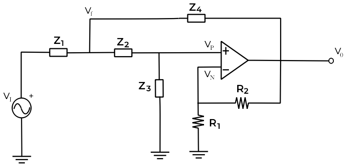

En el último artículo vimos como funcionaba el filtro Sallen-Key, y conseguimos sacar su función de transferencia de forma genérica. **En este post veremos la configuración del filtro paso bajo del tipo Sallen-Key**. **Este post lo voy a dividir en dos partes**, la primera que es esta, más teórica, explicando de donde viene cada cosa, y luego otra más práctica, en el aplicaremos los conceptos al mundo real y veremos con un osciloscopio el funcionamiento de este filtro.

Hay una serie de libros, que recomiendo muchísimo, que son los *"Engineer's Mini-Notebook"* de *Forrest M. Mims III*. Pese a ser libros de los 80's se tocan algunos temas interesantes, los astables 555, los amplificadores operacionales, los semiconductores, etc. En el que habla de los amplificadores operacionales, *"Op Amp IC Circuits"*, enseña algunos circuitos muy interesantes, pero nunca explica de donde vienen las expresiones, ni la estructura del circuito, sino que solo enseña circuitos y para que sirven.

En especial había una página que me llamó mucho la atención, y fue por lo que me decante a estudiar la estructura del filtro Sallen-Key. La página se llama "Low-Pass Filter", y explica un filtro paso bajo con estructura Sallen-Key, pero en ningún momento se para a decir de donde salen las expresiones, por lo que me puse a investigar de este filtro en cuestión.

Por tanto, **este post será sobretodo para explicar de donde vienen todas las expresiones del filtro paso bajo explicado en el libro "Engineer's Mini-Notebook", así como la demostración de las mismas.**

#### Circuito de *Engineer's Mini-Notebook* vs. estructura Sallen-Key

Si comparamos los dos ciruitos, el del libro, que está arriba, y la estrutura genérica del Sallen-Key, justo debajo, vemos que **son lo mismo**:

A simple vista puede parece que son distintos, pero si observamos las ramas de los dos, son las mismas. La diferencia está en que en el genérico utilizamos las impedancias como Z y en el del libro ponemos directamente los componentes en cuestión.

Y ahora la pregunta, **¿Por qué esa estructura?**. La respuesta más rápida es porque es la más famosa. Igualmente vamos a explicar porque se trata de un filtro paso bajo.  

#### Filtro paso bajo activo con estructura Sallen-Key

El circuito de un filtro paso bajo con estructura Sallen-Key es la siguiente:

Primero hace falta explicar que la expresión general de un filtro paso bajo de 2º orden es la siguiente:

$$

H(s = j \omega) = \frac{K}{(\frac{s}{\omega_0})^2 + \frac{s}{Q\ \omega_0} + 1}

$$

Por otro lado, la función de transferencia del filtro Sallen-Key, vista en el [último post](../Sallen-Key/) es la siguiente:

$$

\frac{V_0}{V_I} = \frac{K}{\frac{Z_1 Z_2}{Z_3 Z_4} + \frac{Z_1}{Z_3} + \frac{Z_2}{Z_3} + \frac{Z_1 (1 - K)}{Z_4} + 1}

$$

En donde

$$

Z_1 = R_1 \quad Z_2 = R_2 \quad Z_3 = \frac{1}{j\omega C_1}

\\

Z_4 = \frac{1}{j \omega C_2} \quad K = \frac{R_3 + R_4}{R_3} = 1 + \frac{R_4}{R_3}

$$

Substituyendo en la función de transferencia del filtro Sallen-Key:

$$

\frac{V_0}{V_I}(s = j \omega) = \frac{K}{\frac{R_1 R_2}{\frac{1}{s C_1} \frac{1}{s C_2}} + \frac{R_1}{\frac{1}{s C_1}} + \frac{R_2}{\frac{1}{s C_1}} + \frac{R_1 (1 - K)}{\frac{1}{s C_2}} + 1}

\\

= \frac{K}{s^2 R_1 R_2 C_1 C_2 + s R_1 C_1 + s R_2 C_1 + s R_1 C_2 (1 - K) + 1}

\\

= \frac{K}{s^2 R_1 R_2 C_1 C_2 + s \ (R_1 C_1 + R_2 C_1 + R_1 C_2 (1 - K)) + 1}

$$

Comparando la expresión estandar de un filtro paso bajo con la del Sallen-Key podemos ver que son iguales. **Despejamos** la frecuencia de corte y el factor de calidad:

$$

\bigg (\frac{s}{\omega_0} \bigg)^2 = s^2 R_1 R_2 C_1 C_2 \Rightarrow \frac{s}{\omega_0} = \sqrt{s^2 R_1 R_2 C_1 C_2}

\\

\Rightarrow \omega_0 = \frac{1}{\sqrt{R_1 R_2 C_1 C_2}} \qquad

f_c = \frac{1}{2 \pi \ \sqrt{R_1 R_2 C_1 C_2}}

$$

$$

\frac{s}{Q \ \omega_0} = s \ (R_1 C_1 + R_2 C_1 + R_1 C_2 (1 - K)) \Rightarrow Q \ \omega_0 = \frac{1}{R_1 C_1 + R_2 C_1 + R_1 C_2 (1 - K)}

\\

\Rightarrow Q = \frac{\sqrt{R_1 R_2 C_1 C_2}}{R_1 C_1 + R_2 C_1 + R_1 C_2 (1 - K)}

$$

En el circuito del libro, toma como \\(R = R_1 = R_2\\) y que \\(C = C_1 = C_2\\). Esto se debe a que así se simplifica mucho los cálculos, pero sacrificando la calidad del mismo:

$$

f_c = \frac{1}{2 \pi \ R C}

$$

Donde la ganacia sería:

$$

K = 1 + \frac{R_4}{R_3}

\\

Ganancia = \frac{R_4}{R_3}

$$

Y así ya **hemos conseguido determinar de dónde salen las ecuaciones del circuito propuesto en el libro**.

#### Simulación del circuito mediante PSPICE

Ahora vamos a ver el funcionamiento del mismo simulandolo por medio de PSPICE. La simulación de circuitos es especialmente útil porque todos los cálculos anteriores nos los saltamos y vamos directamente a la solución. A la hora de diseñar y probar circuitos el ordenador es esencial, pues, cuando ya toma complejidad el circuito es imposible analizarlo con boli y papel y tendremos que pasar a la simulación asistida por computadora.

Yo he usado PSPICE porque es uno de los más famosos. Este hace uso del núcle SPICE, que es un software libre dedicado a la simulación de circuitos.

El circuito en PSPICE es el siguiente:

Y si lo analizados por frecuencia nos da como resultado:

Para frecuencias menores que 3K Hz la señal estará amplificada, en cambio para mayores que 3K Hz estará atenuada. Entonces, la gráfica del circuito del libro está correcta, es la misma que la nuestra.

#### Usos del filtro paso bajo Sallen-Key

Habiendo explicado ya todas las demostraciones matemáticas, podemos entender que usos le podemos dar a este circuito.

1. **Ganancia variable**: Cómo la ganancia del filtro sólo depende de las resistencias R4 y R3, poniendole un potenciometro a R4 conseguimos modificar su ganancia sin modificar lo demás propiedades del filtro:

    $$

    K = 1 + \frac{R_4}{R_3}

    $$

2. **Frecuencia de corte variable**: Cómo la frecuencia de corte depende del valor de las resistencias R1 y R2, modificando su resistencia con un potenciometro conseguimos **DESPLAZAR SU FRECUENCIA DE CORTE**. Es decir, conseguimos hace un **CUTOFF FILTER**, super super super típico en la música electrónica.

    $$

    f_c = \frac{1}{2 \pi \ R C}

    $$

    Con un potenciometro de \\(10 K \Omega\\) conseguiremos mover la frecuencia de corte por todo el espectro auditivo (200 - 22k Hz). Si eso lo sumamos al punto 1, de ganancia variable, ya tenemos un circuito bastante resulton para hacer música electrónica.

Un ejemplo de cómo sonaría sería este:

<iframe width="900" height="500" src="https://www.youtube.com/embed/7T4U4dblCH8" frameborder="0" allow="autoplay; encrypted-media" allowfullscreen></iframe>

**Y por fin! Por fin entiendo como se hace la música electrónica explicada desde las matemáticas!** En el próximos post haremos esto mismo en la vida real, a ver si realmente funciona como se espera.

amil101@debian:~$ EXIT

### Enlaces externos
* [http://www.ti.com/lit/an/sloa024b/sloa024b.pdf](http://www.ti.com/lit/an/sloa024b/sloa024b.pdf)
* [https://es.wikipedia.org/wiki/Filtro_de_Sallen-Key](https://es.wikipedia.org/wiki/Filtro_de_Sallen-Key)
